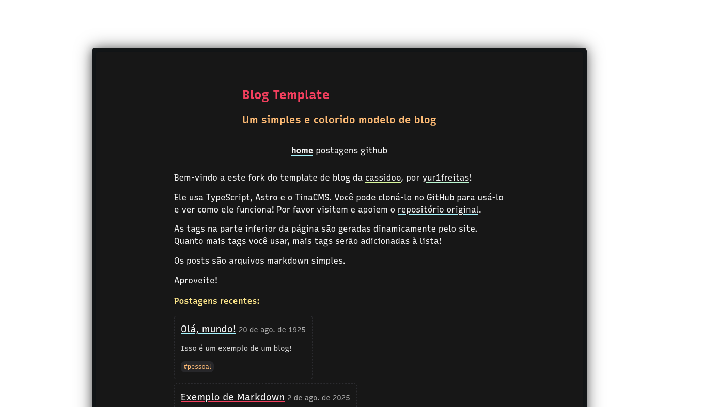
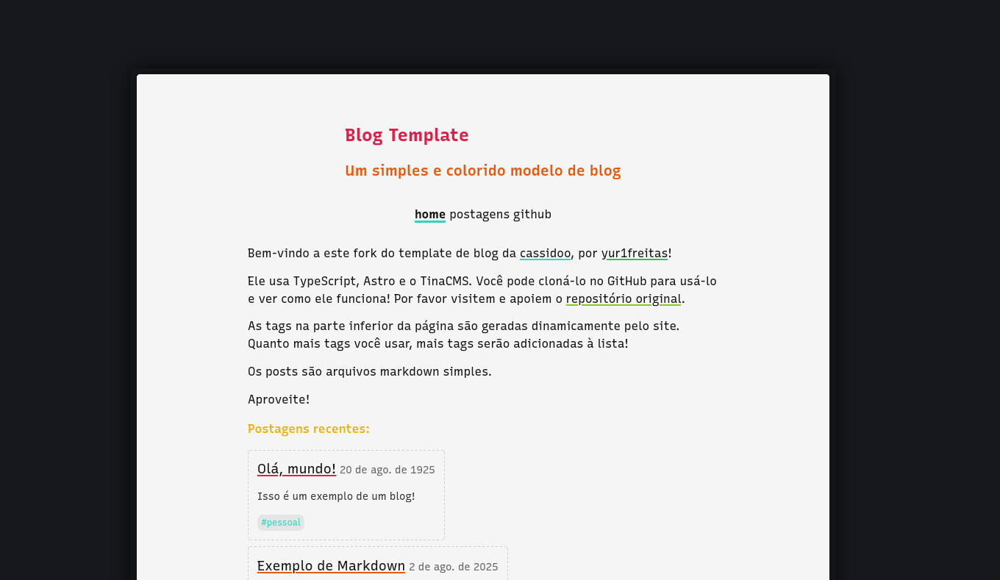

<!-- Credits  -->

[ORIGINAL_REPOSITORY]: https://github.com/cassidoo/blahg
[CASSIDOO_GITHUB]: https://github.com/cassidoo

<!-- Badges: https://github.com/Ileriayo/markdown-badges -->

[BUN_BADGE]: https://img.shields.io/badge/Bun-%23000000.svg?style=for-the-badge&logo=bun&logoColor=white
[TYPESCRIPT_BADGE]: https://img.shields.io/badge/typescript-%23007ACC.svg?style=for-the-badge&logo=typescript&logoColor=white
[ASTRO_BADGE]: https://img.shields.io/badge/astro-%232C2052.svg?style=for-the-badge&logo=astro&logoColor=white
[TINACMS_BADGE]: https://img.shields.io/badge/TinaCMS-FB542B?style=for-the-badge&logo=ollama&logoColor=white

<!-- Official websites of the technologies used -->

[ASTRO_SITE]: https://astro.build/
[TINACMS_SITE]: https://tina.io/
[TYPESCRIPT_SITE]: https://www.typescriptlang.org/
[BUN_SITE]: https://bun.sh/

# Yur1's Blog Template

[![Astro][ASTRO_BADGE]][ASTRO_SITE]
[![TinaCMS][TINACMS_BADGE]][TINACMS_SITE]
[![TypeScript][TYPESCRIPT_BADGE]][TYPESCRIPT_SITE]
[![Bun][BUN_BADGE]][BUN_SITE]

Olá! Este é um template de blog criado a partir do template [blahg][ORIGINAL_REPOSITORY] por [cassidoo][CASSIDOO_GITHUB], por favor visitem e apoiem o projeto original! Agradecimentos [cassidoo][CASSIDOO_GITHUB]!

> [!NOTE]
> Se você receber um erro remoto no esquema GraphQL, provavelmente precisará atualizar o TinaCMS, [detalhes aqui](https://tina.io/docs/introduction/faq#how-do-i-resolve-the-local-graphql-schema-doesnt-match-the-remote-graphql-schema-errors)!

## 🌙 Dark Mode



# ☀️ Light Mode



## 🤔 Como usar

- Conecte-se ao provedor de hospedagem escolhido
- Crie uma conta em [tina.io](https://tina.io/)
- Adicione suas chaves TinaCMS em `.env`
- Atualize `astro.config.ts` com seu domínio
- Edite `src/config.ts`
- Adicione sua URL na linha 1 de `public/robots.txt`
- Adicione seus links em `src/components/Header.astro`
- Atualize a introdução em `pages/about.md`
- Edite as imagens em `public/` (opcional)
- Edite as tags que desejar em `tina/config.ts` (opcional)

Depois disso, você pode adicionar seu conteúdo a `posts/` com arquivos Markdown ou com o TinaCMS, acessando `SUA_URL/admin`

## 🚀 Run

Todos os comandos são executados a partir da raiz do projeto, a partir de um terminal:

| Comando           | Ação                                                  |
| :---------------- | :---------------------------------------------------- |
| `bun install`     | Instala as dependências                               |
| `bun run dev`     | Inicia localmente o servido em `localhost:4321`       |
| `bun run build`   | Compila seu projeto para produção em `./dist/`        |
| `bun run preview` | Veja um preview do projeto compilado, antes do deploy |
| `bun run format`  | Formata seu código com prettier                       |

Acesse `localhost:4321/admin/index.html` para visualizar o CMS e utilizá-lo.

> [!NOTE]
> Este projeto foi configurado para usar `bun` como gerenciador de pacotes, mas pode facilmente ser substituído por `npm`, `yarn` ou `pnpm`. Basta instalar as dependências com um desses e excluir o `bun.lock`

## 🌱 Variáveis de Ambiente

```
TINACLIENTID=<credencial adquirida em tina.io>
TINATOKEN=<credencial adquirida em tina.io>
TINASEARCH=<credencial adquirida em tina.io>

SITE=<url do seu site>
```
